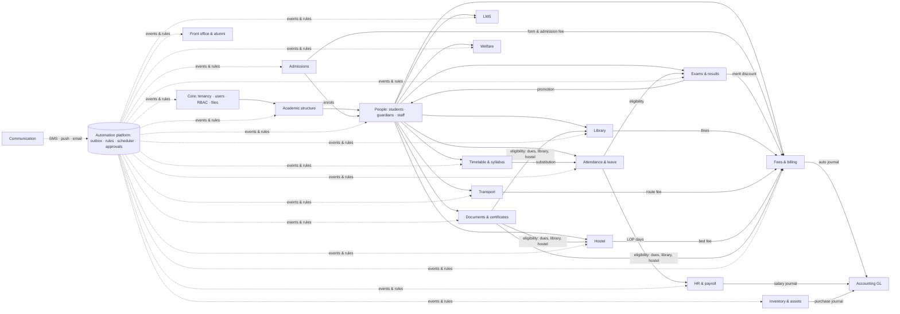
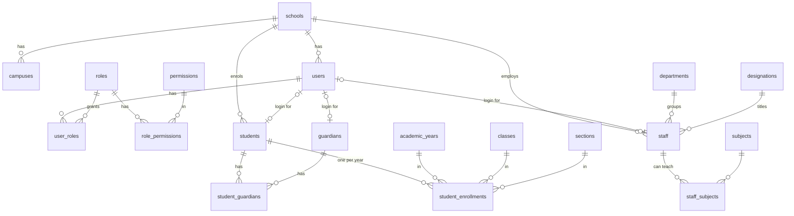
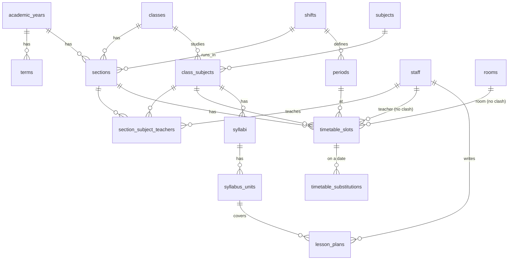
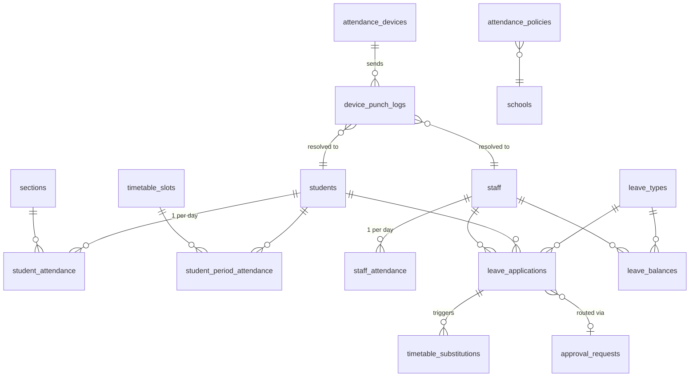
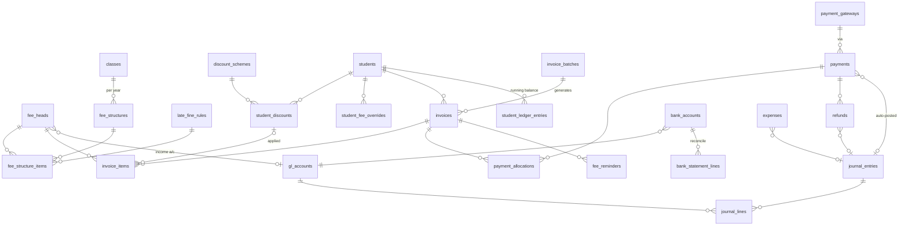
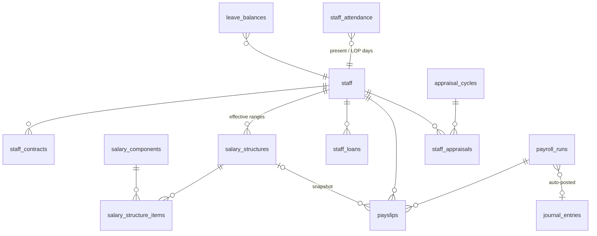
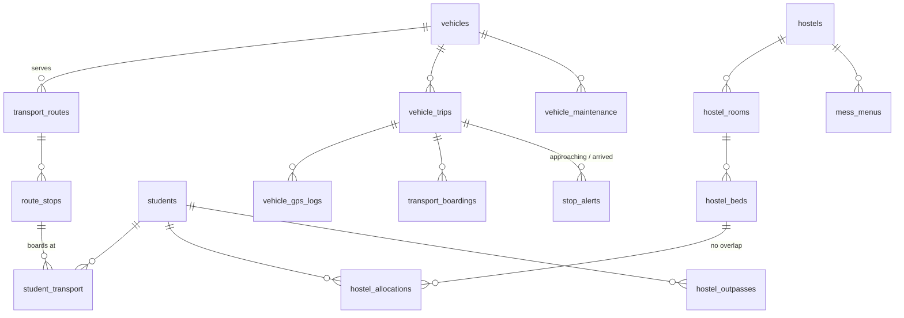
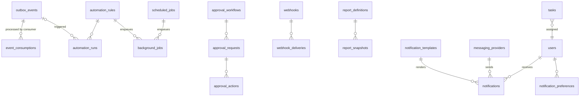

# Pathshala — System Architecture

A-to-Z school management platform where every module is driven by the same automation
engine. This document is the technical reference; `AUTOMATION.md` lists what runs
automatically, `PLAN.md` says in which order to build it, `db/schema/` is the real DDL.

---

## 1. Design goals

| Goal | How the design meets it |
|---|---|
| Every section automated | Every write emits a domain event (transactional outbox). Rules + cron jobs react. Nothing depends on a human remembering to click. |
| Multi-school SaaS, or single-school self-host | Row-level security keyed by `school_id` on 205 tables. Same build works for 1 or 1,000 schools. |
| Bangladesh-first, not Bangladesh-only | Defaults: BDT, `Asia/Dhaka`, Fri+Sat weekend, GPA 5.0 board scale, bKash/Nagad/SSLCommerz, BD SMS gateways, EIIN. All are settings, not hard-code. |
| Guardians on cheap phones | Phone-number + OTP login, SMS fallback for every push, low-bandwidth mobile app. |
| Money must reconcile | Fees, payroll, expenses and inventory all post to one double-entry ledger automatically. Trial balance is a view. |
| Nothing lost, everything auditable | `audit_logs` append-only, soft deletes, frozen snapshots for results, payslips and certificates. |

---

## 2. Technology stack (recommended)

| Layer | Choice | Reason |
|---|---|---|
| API | **NestJS** (TypeScript) modular monolith, REST + OpenAPI | One deployable, clear module boundaries, easy to split later |
| Data access | **Drizzle ORM** + raw SQL for reports | SQL-first; the schema *is* the source of truth |
| Database | **PostgreSQL 16** with RLS, `btree_gist`, `pg_trgm`, `pgcrypto` | Exclusion constraints solve timetable/room clashes in the DB itself |
| Queue / cache | **Redis 7 + BullMQ** | Queues: `events`, `notifications`, `billing`, `payroll`, `pdf`, `sync`, `reports` |
| Object storage | S3-compatible (**MinIO** self-host, S3/R2 cloud) | Photos, documents, generated PDFs |
| PDF | **Gotenberg** (headless Chromium) | Renders `document_templates.html_template` → report cards, receipts, TC, ID cards |
| Web app | **Next.js 15** + Tailwind + TanStack Query | Admin, accounts, teacher desk |
| Mobile | **React Native (Expo)**, FCM push | Guardian, student, teacher, bus-helper apps from one codebase |
| Search | Postgres `pg_trgm` (Meilisearch later) | Name/phone/admission-no lookup |
| BI | **Metabase** on `app_readonly` role + `kpi_daily` | Principal dashboards without custom code |
| Auth | JWT (15 min) + refresh sessions, SMS OTP for guardians, TOTP for admins | See `auth_sessions`, `otp_codes` |
| Observability | OpenTelemetry → Grafana stack, Sentry | Trace a request from API → event → worker |
| Infra | Docker Compose on one VPS to start; Kubernetes past ~50 schools | Everything stateless except Postgres/Redis/MinIO |

> Python team? Django + Celery maps 1:1 to the same schema. Nothing below is framework-specific.

---

## 3. Modular monolith layout

```
apps/
  api/            NestJS
    src/modules/
      core/         schools, campuses, users, roles, settings, files, audit      (01)
      academic/     years, terms, classes, sections, subjects, calendar         (02)
      people/       students, enrollments, guardians, staff                     (03)
      timetable/    slots, substitutions, syllabus, lesson plans                (04)
      admissions/   campaigns, enquiries, applications, tests, offers           (05)
      attendance/   devices, punches, attendance, leave                         (06)
      exams/        grading, exams, marks, results, promotion, online exams     (07)
      lms/          assignments, materials, online classes                      (08)
      accounting/   GL, journals, expenses, bank, budgets                       (09)
      fees/         structures, invoices, payments, ledger, reminders           (10)
      hr/           contracts, salary, payroll, appraisal                       (11)
      library/                                                                  (12)
      transport/                                                                (13)
      hostel/                                                                   (14)
      inventory/                                                                (15)
      communication/ providers, templates, notifications, notices, chat, PTM   (16)
      welfare/      behaviour, health, counselling                              (17)
      documents/    templates, certificates, ID cards                           (18)
      front-office/ visitors, calls, complaints, alumni                         (19)
      platform/     outbox, rules, scheduler, approvals, webhooks, reports      (20)
  worker/         same codebase, runs BullMQ processors + scheduler
  web/            Next.js
  mobile/         Expo
packages/
  db/             Drizzle schema generated from db/schema/*.sql, migrations
  events/         typed event catalogue (shared by api + worker)
  templates/      default notification + document templates (bn + en)
```

**Boundary rules**

1. A module reads other modules through their *service* (in-process), never their tables.
2. A module never *writes* another module's tables. It emits an event; the owner reacts.
   Example: `library` never inserts into `invoice_items`. It emits `library.fine.accrued`;
   the `fees` module's handler adds the invoice item.
3. Every mutating service method runs in one transaction that also inserts into `outbox_events`.

---

## 4. Multi-tenancy & security

* **Row-level security.** `99_finalize.sql` attaches `tenant_isolation` to every table with
  `school_id`. The API middleware runs `SET LOCAL app.school_id = '<uuid>'` after verifying the JWT.
  A forgotten `WHERE school_id = …` cannot leak data.
* **Workers** connect as `app_worker` (`BYPASSRLS`) because schedulers span tenants, and must
  filter explicitly. Every job payload carries `school_id`.
* **Numbering** (`admission_no`, `invoice_no`, `receipt_no`…) via `next_number(school_id, key)`
  with per-school prefix/padding/yearly reset in `number_sequences`.
* **Secrets** (`payment_gateways.credentials`, `messaging_providers.credentials`,
  `integrations.config`) are envelope-encrypted by the app with a KMS/master key; the DB only
  sees ciphertext. `counselling_sessions.notes_encrypted` is additionally restricted to the
  counsellor role.
* **Audit**: `audit_logs` gets INSERT only; no UPDATE/DELETE grants for `app_api`.
* **PII in SMS**: templates never include full addresses or amounts beyond what is needed.

---

## 5. The automation engine

This is the heart of "every section automated". Three ingredients, all in `20_platform.sql`:

```
 ┌───────────────┐   same TX    ┌────────────────┐  relay   ┌──────────────┐
 │ Domain service│ ───────────▶ │ outbox_events  │ ───────▶ │ Redis/BullMQ │
 │ (any module)  │              │ (Postgres)     │  ≤500ms  │  "events"    │
 └───────────────┘              └────────────────┘          └──────┬───────┘
                                                                   │ fan-out
              ┌────────────────────────────┬───────────────────────┼────────────────────┐
              ▼                            ▼                       ▼                    ▼
   ┌────────────────────┐      ┌────────────────────┐   ┌────────────────────┐  ┌─────────────┐
   │ System handlers    │      │ Rule engine        │   │ Webhook dispatcher │  │ KPI / audit │
   │ (non-negotiable:   │      │ automation_rules   │   │ webhooks           │  │ kpi_daily   │
   │ ledger, journal,   │      │ WHEN event         │   └────────────────────┘  └─────────────┘
   │ counters, status)  │      │ IF conditions      │
   └────────────────────┘      │ THEN actions[]     │
                               └─────────┬──────────┘
                                         ▼
                     actions → notify · create_task · add_invoice_item · apply_discount
                               post_journal · generate_document · update_status
                               start_approval · call_webhook · schedule_followup
                                         │
                                         ▼
                               automation_runs (log)  ·  background_jobs (durable)

 ┌───────────────┐  cron (school tz)  ┌──────────────┐   emits events too, e.g.
 │ scheduled_jobs│ ─────────────────▶ │ Scheduler    │ ─▶ billing.month_started, attendance.cutoff_reached
 └───────────────┘  leader lock       └──────────────┘
```

**Two kinds of automation**

| Kind | Where | Editable by school? | Examples |
|---|---|---|---|
| System handlers | code, always on | No | payment → ledger + journal; enrolment → user accounts; marks lock → result computation |
| Rules | `automation_rules` rows (seeded defaults, `is_system=true`) | Yes: toggle, change channel, threshold, template | absent → SMS guardian; overdue 7 days → reminder; GPA ≥ 5 → propose merit discount |

**Guarantees**

* At-least-once delivery + `event_consumptions` idempotency = effectively-once.
* `automation_rules.cooldown_minutes` prevents duplicate firing per aggregate (e.g. one SMS per absence, not per re-save).
* Every action lands in `background_jobs` with retries/back-off; failures are visible in the admin "Automation" screen.
* Rules are evaluated with **JSONLogic** over the event payload plus a small set of resolvers
  (`student.attendance_pct_30d`, `student.outstanding`, `staff.late_count_month`).

**Event catalogue (naming: `<module>.<aggregate>.<verb>`)**

```
core:        user.created · user.deactivated · settings.changed
academic:    academic_year.created · academic_year.closed · calendar.holiday_added · section.created
people:      student.enrolled · student.status_changed · student.section_changed · guardian.linked
             staff.joined · staff.left · staff.document_expiring
timetable:   timetable.published · timetable.substitution_needed · syllabus.behind_schedule
admissions:  enquiry.created · application.submitted · application.fee_paid · test.results_entered
             merit_list.generated · offer.issued · offer.expired · offer.accepted · applicant.enrolled
attendance:  punch.received · attendance.marked · attendance.absent · attendance.late
             attendance.consecutive_absent · attendance.below_threshold · leave.applied · leave.approved
exams:       exam.scheduled · admit_cards.generated · marks.submitted · marks.locked
             result.computed · result.published · promotion.decided
lms:         assignment.published · assignment.due_soon · submission.received · online_class.starting
fees:        invoice.issued · invoice.due_soon · invoice.overdue · fine.applied · payment.received
             payment.failed · refund.approved · discount.proposed · discount.approved
accounting:  journal.posted · expense.requested · expense.approved · budget.threshold_crossed
hr:          payroll.drafted · payroll.approved · payslip.generated · contract.expiring · leave_balance.accrued
library:     book.issued · book.due_soon · book.overdue · book.returned · reservation.ready
transport:   trip.started · bus.approaching_stop · student.boarded · student.alighted · trip.delayed
             vehicle.document_expiring · vehicle.overspeed
hostel:      bed.allocated · outpass.approved · outpass.late_return · curfew.missed
inventory:   stock.below_reorder · po.received · asset.maintenance_due · asset.warranty_expiring
welfare:     incident.reported · behaviour.threshold_crossed · vaccination.due · clinic.visit_logged
documents:   document.requested · document.eligibility_checked · document.issued
front_office: visitor.checked_in · complaint.created · complaint.sla_breached
platform:    rule.failed · sms_balance.low · import.finished · kpi.anomaly
```

---

## 6. Module dependency map



---

## 7. Entity–relationship diagrams (key tables per module)

### 7.1 Core & people



### 7.2 Academic structure & timetable



### 7.3 Attendance & leave



### 7.4 Examinations

```mermaid
erDiagram
  grading_scales ||--o{ grading_bands : has
  exam_types ||--o{ exams : ""
  academic_years ||--o{ exams : ""
  grading_scales ||--o{ exams : uses
  exams ||--o{ exam_schedules : "one per class-subject"
  class_subjects ||--o{ exam_schedules : ""
  exam_schedules ||--o{ marks : ""
  students ||--o{ marks : ""
  exams ||--o{ exam_seat_plans : ""
  exams ||--o{ exam_results : "computed"
  students ||--o{ exam_results : ""
  promotion_rules }o--|| academic_years : ""
  student_enrollments ||--o| promotions : from
  student_enrollments |o--o| promotions : to
  questions ||--o{ online_exam_questions : ""
  online_exams ||--o{ online_exam_questions : ""
  online_exams ||--o{ online_exam_attempts : ""
  exam_schedules |o--o{ online_exams : "syncs marks"
```

### 7.5 Fees, payments & accounting



### 7.6 HR & payroll



### 7.7 Transport & hostel



### 7.8 Automation platform



---

## 8. Request lifecycle (example: guardian pays via bKash)

1. Guardian app calls `POST /payments/initiate` → API creates `payments` row (`pending`), returns gateway URL.
2. bKash IPN hits `POST /webhooks/bkash` → signature verified → in one transaction:
   `payments.status=success`, `payment_allocations` (oldest invoices first), `invoices.paid_total`,
   `student_ledger_entries`, `outbox_events(payment.received)`.
3. Relay publishes the event. Consumers:
   * system handler → `journal_entries` (Dr bKash merchant a/c, Cr Tuition income, Cr Fine income; gateway fee → expense)
   * rule "receipt" → `background_jobs(pdf)` → Gotenberg → `files` → `payments.receipt_file_id`
   * rule "payment thanks" → `notifications` (SMS + push) via default provider
   * rule "unblock" → if no overdue left, `exam_seat_plans.is_eligible=true` for upcoming exams
   * webhook dispatcher → school's own ERP if configured
4. `automation_runs` and `background_jobs` record each step; the admin sees them under Automation → Activity.

---

## 9. Policy settings (`settings` table keys)

| Key | Default | Used by |
|---|---|---|
| `attendance.auto_absent_at` | `10:30` | attendance cut-off job |
| `attendance.notify_channels` | `["sms","push"]` | absent/late notifications |
| `fees.invoice_generation_day` | `1` | monthly invoicing job |
| `fees.reminder_stages` | `[-3, 0, 7, 15, 30]` | reminder scheduler (days relative to due) |
| `fees.block_admit_card_on_overdue` | `true` | exam eligibility |
| `fees.allocation_order` | `oldest_first` | payment allocation |
| `exams.rank_ties` | `share_rank` | result engine |
| `exams.auto_publish` | `false` | publish at `exams.publish_at` automatically |
| `payroll.run_day` | `25` | payroll draft job |
| `payroll.lop_from_lates` | `3` | N lates = 1 LOP day |
| `library.fine_per_day` | `5` | overdue fine job |
| `transport.geofence_alert` | `true` | GPS consumer |
| `hostel.curfew_alert_minutes` | `30` | late-return alert |
| `notifications.quiet_hours` | `["21:00","07:00"]` | defer non-urgent SMS/push |
| `documents.tc_requires_clearance` | `true` | document eligibility check |

---

## 10. Scaling notes

* `device_punch_logs`, `vehicle_gps_logs`, `notifications`, `audit_logs`, `outbox_events` are the
  high-volume tables: partition by month once a tenant exceeds ~1M rows; archive to object storage.
* `mv_student_attendance_monthly` refreshed nightly (`REFRESH … CONCURRENTLY`).
* Read replicas for Metabase and report generation.
* Each school's data can be exported/deleted by `school_id` (tenant off-boarding).
